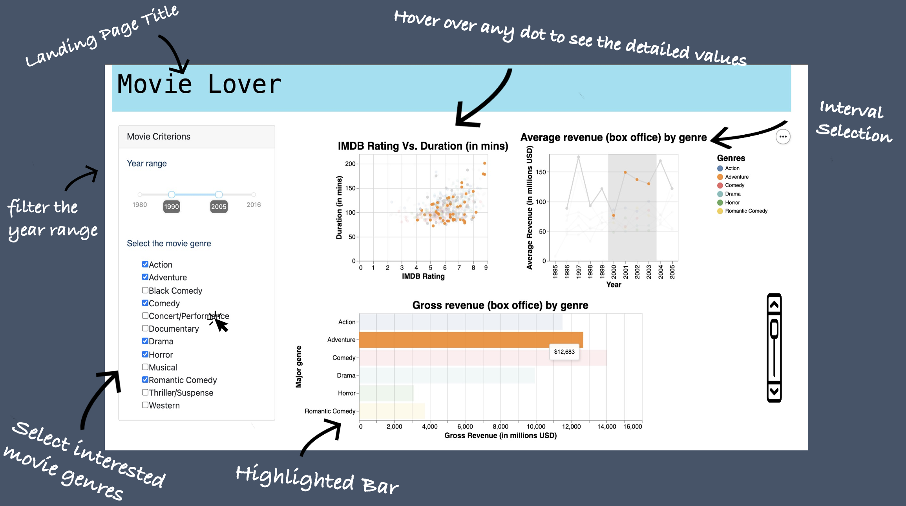

# movielover_py

Dashboard of movie information for movie enthusiast

### Visualization App Purpose

The full proposal can be found in [our proposal file](https://github.com/UBC-MDS/movielover_py/blob/main/docs/proposal.md).

### App Description

`Movie Lover` is a dashboard designed to help movie enthusiasts explore various information (depending on the filter constraints) about movies, such as the US gross revenue for different movies genres (in a bar chart), the relationship between runtime and rating (scatter plot), as well as a top-rated movies table (scrollable tabular data). Users can filter out the movies' release years using the slider bar underneath the landing page's title. Underneath the slider, there is a dropdown menu, where users can select the movies genres they are interested in. The bar chart and scatter plot will be shown on the right side above the table. In the bar chart, a genre with the highest revenue will have a brighter colour. As for the scatter plot, when users hover over the points, detailed values of runtime and rating will pop up on the top. At the bottom table, users are able to check out movie information regards of `Ranking`, `Movie Titles`, `Duration (mins)` and `MPAA Rating`.

### App Sketch  

### Contribution

We welcome all feedback and contributions. If you are interested in contributing to our app, please read our [contributing document](https://github.com/UBC-MDS/movielover_py/blob/main/CONTRIBUTING.md) and our [code of conduct](https://github.com/UBC-MDS/movielover_py/blob/main/CODE_OF_CONDUCT.md). Our [license](https://github.com/UBC-MDS/movielover_py/blob/main/LICENSE) outlines our permissions and copyright information for users.

### Contributors

This GitHub repository was created by Adrianne Leung, Junrong Zhu, Linhan Cai and Zack Tang.
