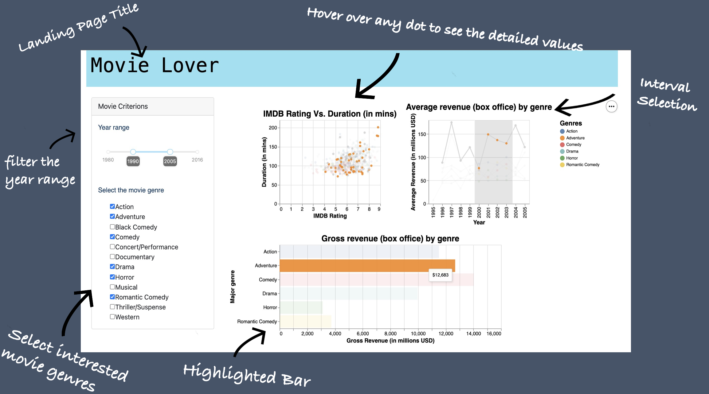

# movielover_py

To visit our deployed dashboard on **Heroku**, please visit the [link](https://dsci532-group21-movielover.herokuapp.com/).

Hello!🍺  Bonjour! 🎉  Hola！👋  你好！🎆  Thanks for visiting the dashboard of movie information for movie enthusiasts!!

This document (the README file) will provide general information about the app. You can select one of the following options for a specific section!
 
* [Visualization App Purpose](#visualization-app-purpose)
* [Usage Instructions](#usage-instructions)
* [App Description](#app-description)
* [App Sketch](#app-sketch)
* [Contribution](#contribution)
* [How to Install and Run Locally](#how-to-install-and-run-locally)
* [Set Up](#set-up)
* [Run the Dashboard](#run-the-dashboard)
* [Contributors](#contributors)

### Visualization App Purpose

Millions of movies are published on a variety of channels; however, filtering excellent movies could be time-consuming. If we could provide a list of popular movies based on customers' preferences and illustrate approximation of box offices from different dimensions, they will save a large amount of time on searching for high-quality movies. To solve this challenge, we propose building a data visualization app that allows movie enthusiasts to explore the top 10 popular movies, box offices and other relevant information. Our app can be served as a great exploratory tool for people who like visualization and friendly-user-interface to extract various data at the same time with minimum efforts to select the filters.

The full proposal can be found in [our proposal file](https://github.com/UBC-MDS/movielover_py/blob/main/docs/proposal.md).

### Usage Instructions

Users can select year range and multiple genres in the sidebar to filter out movie data to visualize in the dashboard. The dashboard contains three graphics (bar chart, line chart and scatterplot). A detailed introduction to the graphics can be found in the followed section.

Our app support interactivity between graphs. Detailed instruction as follows:
- Bar chart: Total US revenue of a movie genre will be shown by hovering over the bar. Also, users can click a genre to make it highlighted and the other two graphs will change automatically to specify a genre as well.
- Line chart: Average US revenue of a movie genre in the year will be shown by hovering over the point on the line. Moreover, users can select an interval to highlight a more specified period.
- Scatter plot: IMDB rating and duration of a movie will be shown by hovering over the point. Interval selection is also supported in the scatterplot to serve presentation needs. 

### App Description

`Movie Lover` is a dashboard designed to help movie enthusiasts explore various information (depending on the filter constraints) about movies, such as the US gross revenue for different movies genres (in a bar chart), the relationship between runtime and rating (scatter plot), as well as trends of average gross revenue by genres in selected year range. Users can filter out the movies' release years using the slider bar underneath the landing page's title. Underneath the slider, there is a click box, where users can select the movies genres they are interested in. The line chart and scatter plot will be shown on the right side above the bar chart.

### App Sketch  



### Contribution

We welcome all feedback and contributions. If you are interested in contributing to our app, please read our [contributing document](https://github.com/UBC-MDS/movielover_py/blob/main/CONTRIBUTING.md) and our [code of conduct](https://github.com/UBC-MDS/movielover_py/blob/main/CODE_OF_CONDUCT.md). Our [license](https://github.com/UBC-MDS/movielover_py/blob/main/LICENSE) outlines our permissions and copyright information for users. You are welcomed to raise new ideas and report any existing bugs. 

### How to install and run locally

To run the dashboard locally, it is recommended to use a virtual environment like [venv](https://docs.python.org/3/library/venv.html). The installation process with venv is demonstrated below.

### Set up

Run the following command at the **root** directory of the project in the terminal:

```
# Create the virtual environment
python -m venv myenv

# Activate the environment
source myenv/bin/activate

# Install the requirements
pip install -r requirements.txt
```

### Run the dashboard

```
python src/app.py
```

The dashboard could then be accessed locally in <localhost:8050>. 

*Tips for dashboard first-time users: you might see something similar to `Dash is running on http://127.0.0.1:8050/` after running the command above, by simply copying and pasting `http://127.0.0.1:8050/` to a browser, you will be able to view the dashboard. If you keep the dashboard open, the page will automatically refresh whenever you make additional error-free changes.* 


### Contributors

This GitHub repository was created by Adrianne Leung, Junrong Zhu, Linhan Cai and Zack Tang.
